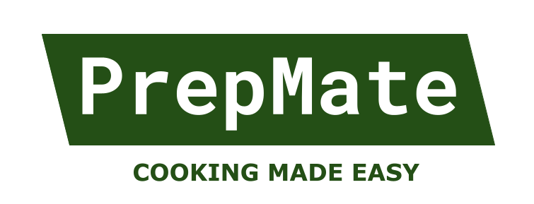

# PrepMate

## Table of contents

The following topics are discussed in this readme:  
* [About PrepMate](#about)
* [How to install and run the application](#how-to-install-&-run)
* [List of features](#list-of-features)
* [Credits](#credits)
* [Acknowledgement](#acknowledgement)
* [License](#license)

## About

The purpose of this project is to create a tool that either aids the user 
with a problem or solves a problem for the user. The name of the tool created
for this project is PrepMate: an app meant for anyone who wants to prepare their meals quickly and consciously in as little time as possible, 
for example, students or anyone with an overfull schedule. Instead of having to 
spend Sunday morning looking through the entirety of the internet for recipes 
conforming to your dietary restrictions or preferences (often on websites with filters 
insufficient for your needs) to know what to cook the following week, and then manually 
going through every recipe to add up the ingredients, PrepMate can do all this for you and more. 
Thus, the app aims to encourage users to prepare their meals and simplify and facilitate the process, 
thereby saving them time and aiding them in their diet. 

In short, PrepMate lets the user search for recipes 
based on information like food allergies and personal preferences. 
The user can then choose a recipe, plan it for a specific day and add the 
ingredients for the recipe to a shoppinglist automatically. The shoppinglist 
can be edited by the user, and the user can add personal recipes to the app. 
Click [here](#list-of-features) for the list of features.

## How to Install & Run

* Install [Python 3.12](https://www.python.org/downloads/).
* When using Windows: Add python 3.12 to your path as the installer does not do this:
  * You can find python in this location if you used the installer: `C:\Users\<user>\AppData\Local\Programs\Python\Python312`
  * Also add `C:\Users\<user>\AppData\Local\Programs\Python\Python312\Scripts`
  * Appdata is a hidden folder. You need to configure your file explorer to show those by going to view -> show hidden items.
  * After updating your path you should reboot your editor and/or terminal.
  * If your correctly updated your path but the next step (running `python --version`) gives an error about Microsoft settings, do the following:
    * Go to the mentioned settings.
    * Scroll down and disable the two items that reference python.
    * Everything should now work again.
* Run `python --version` to check that the right version of Python (3.12) is installed.
* Install the dependencies:
  * Install the virtual environment by running `python -m pip install pipenv`.
  * Run the `pipenv sync` command in your IDE to install the dependencies.
  * Select the generated virtual environment as the python interpreter.
* Run the application in one of the following ways. 
  * Execute the project using your IDEs functionality for this, potentially after restarting the IDE if it did not work.
  * Run `python -m project` in the integrated terminal with the pipenv environment active.
  * Run `pipenv run python -m project` in a terminal without the pipenv environment active.

## List of features

Below is a list of features of the current version of PrepMate.
* User Information:
  * Specify your dietary restrictions and food allergies.
* Recipe Recommendations:
  * Search for recipes based on your dietary restrictions and food allergies.
  * Specify your personal preferences regarding preparation time and amount of calories per serving.
  * Search for recipes based on your preferred maximum preparation time or preferred amount of calories per serving.
  * Preview suggested recipes.
  * Refresh to create new recipe suggestions.
  * Plan suggested recipe's on any day in the upcoming week.
  * Automatically add the right amount of servings for your planned recipes to your shoppinglist.
* Shoppinglist:
  * View your shoppinglist.
  * Check off items from your shoppinglist.
  * Add items to your shoppinglist.
  * Delete items from your shoppinglist.
* Meal Plan Calendar:
  * View your planned meals for the upcoming week.
* Add Recipe:
  * Add your own recipes to the database.

## Credits
The people listed below are the students working on this project.

### Eglé Sakalauskaité
GitLab profile: [@esakalauskaite](https://gitlab.ewi.tudelft.nl/esakalauskaite)  
Student number: 5566207  
Email: e.sakalauskaite@student.tudelft.nl  

### Gijs Six
GitLab profile: [@gsix](https://gitlab.ewi.tudelft.nl/gsix)  
Student number: 5574242  
Email: g.c.six@student.tudelft.nl

### Hiba Azzim
GitLab profile: [@hazzim](https://gitlab.ewi.tudelft.nl/hazzim)  
Student number: 5304881  
Email: h.azzim@student.tudelft.nl

### Ischa Hollemans
GitLab profile: [@ihollemans](https://gitlab.ewi.tudelft.nl/ihollemans)  
Student number: 5415039  
Email: i.hollemans@student.tudelft.nl

### Yasmina Aarkoub
GitLab profile: [@yaarkoub](https://gitlab.ewi.tudelft.nl/yaarkoub)  
Student number: 5416930  
Email: y.aarkoub@student.tudelft.nl

## Acknowledgement

We want to give a special thanks to our teaching assistant Ana Marcu and the course instructor Ivar de Bruin for supervizing this project and teaching us about computer science.

## License
The license for this project can be found in de LICENSE file. The choice for a MIT license was made because it is simple and permissive and we believe it is a good license for a student project.
